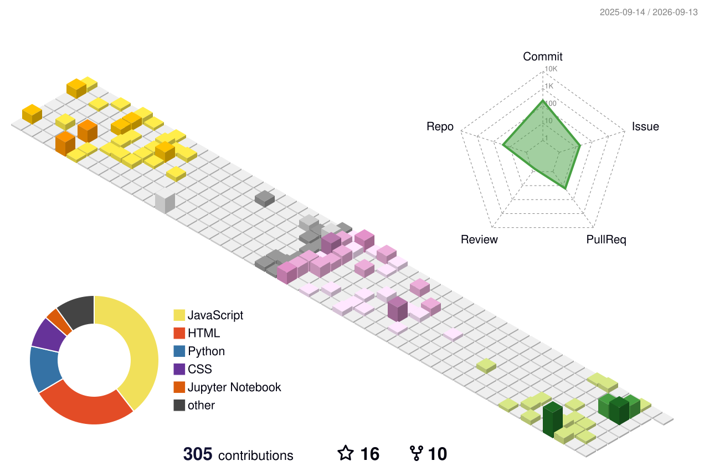

Machine learning engineer in Bengaluru, finishing a BE in AI and ML at Acharya Institute of
Technology in 2027.

### Now

Machine learning intern at **Kapture CX**, where I mostly work with LLM based systems.
That sometimes includes but is not limited to model training , post training , fine-tuning and inferenece optimisations.

Before that I freelanced for **Southern Railway**, building a document ingestion pipeline that
distributes RDSO engineering standards and uses ETag revision tracking so it re-fetches a document
only when the document has changed.

### Things I've built

**[switchboard](https://github.com/sankalp-happy/switchboard)** is an LLM gateway. It sits between
your app and Groq, Google, or Anthropic, speaks the OpenAI API so nothing downstream has to change,
caches semantically similar prompts in Redis, and rotates to a fresh key the moment one returns a
429. Keys are encrypted at rest with Fernet, and there are Grafana dashboards for the parts you
only care about at 2am.
[Live](https://switchboard-tau-ruby.vercel.app)

**[PharmaGuard](https://pharmaguard-tbo.netlify.app)** turns a genomic VCF file into prescribing
guidance. PharmCAT and the CPIC rule set make every clinical decision, deterministically. Llama 3.3
is allowed to write the explanation and nothing else, which is the only arrangement I'd trust near
a prescription.

**[MediAssist AI](https://github.com/IAteNoodles/MedAssist)** is RAG clinical decision support with
appointment booking and a doctor dashboard, built on LangChain over a vector store with XGBoost
alongside it.

Also: **Red Agent**, a vulnerability scanner with modular exploit checks (FastAPI, Redis, AWS);
dropout implemented from the paper, forward and backward pass, in NumPy; and hybrid search over
PDFs combining FAISS with TF-IDF because dense retrieval alone kept missing exact terms.

Four hackathon wins so far, plus overall champion at XActitude techfest.

### Stack

Languages

Serving and modelling

Services and data

### A snake is eating last year

  <picture>
    <source media="(prefers-color-scheme: dark)" srcset="https://raw.githubusercontent.com/sankalp-happy/Sankalp-happy/output/github-snake-dark.svg">
    <source media="(prefers-color-scheme: light)" srcset="https://raw.githubusercontent.com/sankalp-happy/Sankalp-happy/output/github-snake.svg">
    
  </picture>

### The same year, stacked

  <picture>
    <source media="(prefers-color-scheme: dark)" srcset="./profile-3d-contrib/profile-night-rainbow.svg">
    <source media="(prefers-color-scheme: light)" srcset="./profile-3d-contrib/profile-season.svg">
    
  </picture>

   

  

Both graphs rebuild themselves every night at 18:00 UTC.

